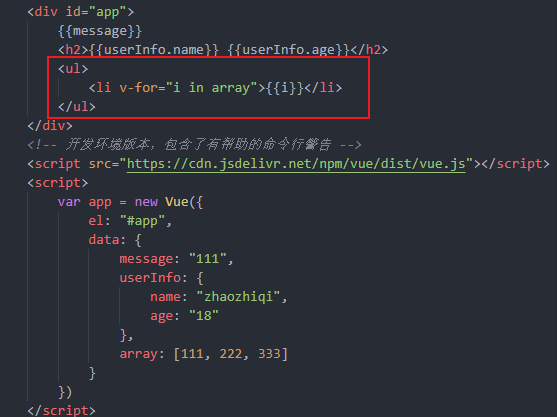
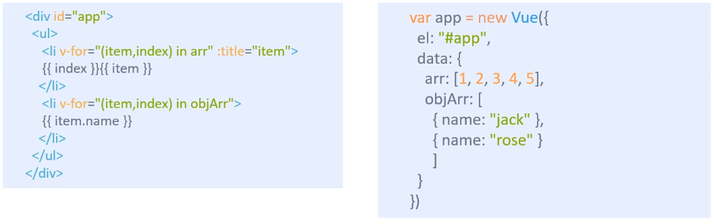
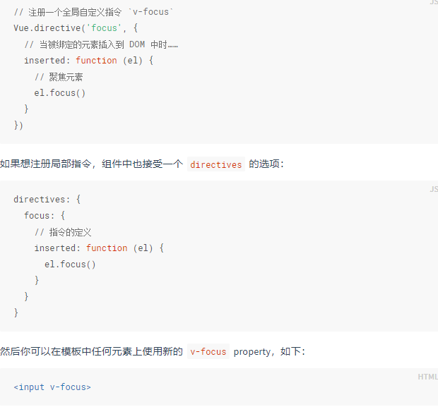
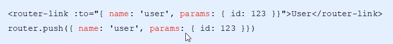
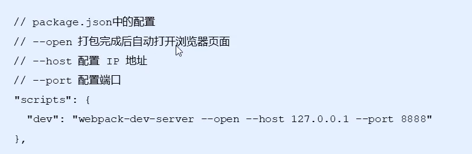

# 						一、Vue基础

## 1.Vue简介

Vue是一个渐进式JavaScript框架，主要用于**简化DOM操作**，特点是**响应式数据驱动**，数据变化，网页自动变化。

声眀式渲染→组件系统→客户端路由→集中式状态管理→项目构建

可以使用其中一部分，也可以使用全部的功能，所以说是渐进式的

## 2.第一个Vue程序


`<!-- 开发环境版本，包含了有帮助的命令行警告 --> `

`<script src="https://cdn.jsdelivr.net/npm/vue/dist/vue.js"></script>`


## 3.el:挂载点

**作用：用来设置Vue实例挂载(管理)的元素**

- Vue会管理el选项**命中的元素**及其**内部的后代元素**
- 可以使用其他选择器，但是**推荐使用id选择器**
- 可以使用除了body和html之外的双标签，但是**推荐使用div**


## 4.data属性



data数据渲染的方式有点类似于模板引擎，不同的是Vue中**判断用v-if**指令，**循环用v-for**指令


# 二、Vue指令

Vue指令是以v-开头的特殊语法

本质是自定义属性

## 1.v-text

作用：设置标签内文本的值(contentText)


v-text会完全替换标签内的值，**插值表达式{{}}**可以替换部分内容，还可以进行字符串拼接


## 2.v-html

作用：设置标签内的html

和v-text不同的是，如果内容有html标签，就会被解析出来


## 3.v-on

作用：为元素绑定事件，方法写在methods属性中


**！！！：**这里的<u>v-on:</u>可以替换为<u>@</u>

用this关键字访问data中的数据


### 补充

**传递自定义参数，事件修饰符**


事件绑定用函数调用的方式写可以传递参数

在事件后面跟上**.修饰符**可以对事件进行限制

**audio标签有play和pause事件**


**传参**

- 如果不传参，默认第一个参数是事件名称
- 如果传递了参数，事件名称要放在最后一个，且事件名为$event


## 4.v-show

作用：根据表达式的真假，来设置元素的显示和隐藏


本质是切换元素的display


## 5.v-if

作用：根据表达式的真假，来操作元素的显示和隐藏(操作DOM)


## 6.v-bind

作用：设置元素的属性


注意：设置属性时v-bind可以直接省略，从：开始写


## 7.v-for

作用：根据数据生成列表结构



在循环前面加**:key**可以增加性能

`<li :key='item.id' v-for='(item,index) in arr'>{{index}}</li>`


## 8.v-model

作用：获取和设置表单元素的值(**双向数据绑定**)


更改表单或者Vue实例中的值，两边的值会同步更新

其本质是一个语法糖


## 9.v-cloak


这个指令是为了解决闪动，意思是，先将元素隐藏，直到数据编译后再显示出来

## 10.v-pre

跳过编译过程，直接显示原始信息


## 11.v-once

数据只编译一次，如果显示信息只需要显示一次，不用再更改可以使用，能提高性能


## 12.MVVM思想

M=model(模型)--就是数据

V=view(视图)--DOM

VM=view-model


**在vue中，vm就是vue的一个实例对象**

**vue中的**

**this===vm**


## 13.补充

### 数组变更方法

在Vue中对数组方法进行了重新包裹

下面几个方法会直接改变原有数组


这三个方法会返回一个新的数组


### 修改响应式数据


用上面两种方法才之后，再用**vm.item.index = 'xxx'**可以修改响应式数据


# 三、axios

`<script src="https://unpkg.com/axios/dist/axios.min.js"></script>`

axios是基于 promise 的 HTTP 库，可以使用promise的各种方法

## 1.axios发送请求

可以发送get、post、delete、put等请求

### **get请求**

```js
// 为给定 ID 的 user 创建请求
axios.get('/user?ID=12345',{
    params:{
        id:1
    }
})  .then(function (response) {    console.log(response);  })  .catch(function (error) {    console.log(error);  });
```

这里数据也可以以对象的形式写在第二个参数里，或者在第二个参数里有一个params对象，在里面写参数


**post请求**

```js
axios.post('/user', {    firstName: 'Fred',    lastName: 'Flintstone'  })  .then(function (response) {    console.log(response);  })  .catch(function (error) {    console.log(error);  });
```


或者将请求方式写在参数里

```js
// 发送 POST 请求
axios({  method: 'post',  url: '/user/12345',  data: {    firstName: 'Fred',    lastName: 'Flintstone'  }});
```


### **URLSearchParams传递常规的表单参数**


## 2.axios响应数据

- data：实际响应回来的数据
- headers：响应头信息
- status：响应状态码
- statusText：响应状态信息


## 3.全局配置

- axios.defaults. timeout=3000；//超时时间
- axios.defaults.baseurl=‘http://localhost:3000/app'  //默认地址
- axios.defaults.headers['mytoken']= 'aqwerwqwergwer2ewwe23 eresdfa23'     //设置请求头


## 4.axios拦截器

### 4.1请求拦截器

请求发送之前进行一些信息设置


### 4.2响应拦截器


代码示例

```js
	# 1. 请求拦截器 
	axios.interceptors.request.use(function(config) {
      console.log(config.url)
      # 1.1  任何请求都会经过这一步   在发送请求之前做些什么   
      config.headers.mytoken = 'nihao';
      # 1.2  这里一定要return   否则配置不成功  
      return config;
    }, function(err){
       #1.3 对请求错误做点什么    
      console.log(err)
    })
	#2. 响应拦截器 
    axios.interceptors.response.use(function(res) {
      #2.1  在接收响应做些什么  
      var data = res.data;
      return data;
    }, function(err){
      #2.2 对响应错误做点什么  
      console.log(err)
    })
```


# 四、Vue常用特性

## 1.表单操作

### 1.1表单操作

全部用v-model进行双向数据绑定，textarea也是


### 1.2表单修饰符

- number转化为数值
- trim：去掉开始和结尾的空格
- lazy：将 input事件切换为 change（change是失去焦点时触发）事件


## 2.定义指令




**自定义指令可以带参数**

通过binding.value获取带参数的值


## 3.计算属性

### 3.1为什么要用计算属性

计算属性可以将对属性值的计算等操作放在computed中，而不用放在模板中，**这样可以简化模板**，调用时只需要写**函数名**即可


必须要用return返回计算后的值


### 3.2计算属性和方法的区别

- 计算属性是基于它们的依赖进行缓存的

意思是，计算方法在第一次计算后会把**计算结果放在缓存中**，第二次调用时直接从缓存中拿到结果。如果**依赖的值发生变化，才会重新计算**

- 方法不存在缓存


## 4.侦听器

在数据变化时执行异步或者开销较大的操作时，需要用到**侦听器**


### 使用方法


## 5.过滤器

作用：格式化数据，比如将字符串格式数据格式化为首字母大写，日期格式化为制定格式


### 使用

过滤器可以用在两个地方：**双花括号插值和 `v-bind` 表达式**

先自定义过滤器


然后在模板中使用


可以同时使用多个过滤器(级联)


**带参数的过滤器** 

默认传递的**第一个参数是插值中的值**，**第二个参数接收传递过来的参数**


### 局部过滤器

在Vue实例内部定义


## 6.生命周期

###  1.主要阶段


2.Vue实例的产生过程


# 五、组件化开发

## 1.组件化开发思想

### 1.1编程中组件化开发思想

将不同的功能变成不同的组件

header、aside等不同的组件组成完整的网页


### 1.2组件化规范：Web Componets

自己想要实现组件化开发并不容易


## 2.组件注册

### 2.1全局组件注册语法

```html
<script>
    Vue.component('组件名称', {

        data:组件数据,

        template:组件模板内容

     })   

      //第1个参数是标签名称，第2个参数是一个选项对象
</script>
```


- **全局组件**注册后，任何**vue实例**都可以用

基本使用

```html
<div id="example">
  <!-- 2、 组件使用 组件名称 是以HTML标签的形式使用  -->  
  <my-component></my-component>
</div>
<script>
    //   注册组件 
    // 1、 my-component 就是组件中自定义的标签名
	Vue.component('my-component', {
      template: '<div>A custom component!</div>'
    })

    // 创建根实例
    new Vue({
      el: '#example'
    })

</script>
```

**注意：**

- 组件参数的data值必须是函数同时这个函数要求返回一个对象 (其实是**产生了一个闭包**，让每个组件有自己独立的数据)
- 组件模板必须是单个根元素(即不能是两个兄弟元素)
- 组件模板的内容可以是模板字符串

```html
  <div id="app">
     <!-- 
		4、  组件可以重复使用多次 
	      因为data中返回的是一个对象所以每个组件中的数据是私有的
		  即每个实例可以维护一份被返回对象的独立的拷贝   
	--> 
    <button-counter></button-counter>
    <button-counter></button-counter>
    <button-counter></button-counter>
      <!-- 8、必须使用短横线的方式使用组件 -->
     <hello-world></hello-world>
  </div>

<script type="text/javascript">
	//5  如果使用驼峰式命名组件，那么在使用组件的时候，只能在字符串模板中用驼峰的方式使用组件，
    // 7、但是在普通的标签模板中，必须转化为短横线的方式使用组件(命名可以是驼峰命名法)
     Vue.component('HelloWorld', {
      data: function(){
        return {
          msg: 'HelloWorld'
        }
      },
      template: '<div>{{msg}}</div>'
    });
    
    
    
    Vue.component('button-counter', {
      // 1、组件参数的data值必须是函数 
      // 同时这个函数要求返回一个对象  
      data: function(){
        return {
          count: 0
        }
      },
      //  2、组件模板必须是单个根元素
      //  3、组件模板的内容可以是模板字符串  
      template: `
        <div>
          <button @click="handle">点击了{{count}}</button>
          <button>测试123</button>
			#  6 在字符串模板中可以使用驼峰的方式使用组件	
		   <HelloWorld></HelloWorld>
        </div>
      `,
      methods: {
        handle: function(){
          this.count += 2;
        }
      }
    })
    var vm = new Vue({
      el: '#app',
      data: {
        
      }
    });
  </script>
```


### 2.2局部组件注册

局部注册的组件只能在注册它的实例中使用

```html
  <div id="app">
      <my-component></my-component>
  </div>


<script>
    // 定义组件的模板
    var Child = {
      template: '<div>A custom component!</div>'
    }
    new Vue({
      //局部注册组件  
      components: {
        // <my-component> 将只在父模板可用  一定要在实例上注册了才能在html文件中使用
        'my-component': Child
      }
    })
 </script>
```


## 3.Vue调试工具

在网上自己找方法下载，右上角的Vue图标亮了就表示可以使用


## 4.组件间数据交互

### 4.1父组件向子组件传值

- 子组件通过props接收父组件传过来的值
- 父组件通过属性将值传递给子组件，可以是动态数据
- 如果props中使用驼峰形式，模板中需要转换为短横线形式来使用，在字符串形式的模板中不存在这个限制

```html
  <div id="app">
    <div>{{pmsg}}</div>
     <!--1、menu-item  在 APP中嵌套着 故 menu-item   为  子组件      -->
     <!-- 给子组件传入一个静态的值 -->
    <menu-item title='来自父组件的值'></menu-item>
    <!-- 2、 需要动态的数据的时候 需要属性绑定的形式设置 此时 ptitle  来自父组件data 中的数据 . 
		  传的值可以是数字、对象、数组等等
	-->
    <menu-item :title='ptitle' content='hello'></menu-item>
  </div>

  <script type="text/javascript">
    Vue.component('menu-item', {
      // 3、 子组件用属性props接收父组件传递过来的数据  
      props: ['title', 'content'],
      data: function() {
        return {
          msg: '子组件本身的数据'
        }
      },
      template: '<div>{{msg + "----" + title + "-----" + content}}</div>'
    });
    var vm = new Vue({
      el: '#app',
      data: {
        pmsg: '父组件中内容',
        ptitle: '动态绑定属性'
      }
    });
  </script>
```


### 4.2props属性的值

props属性值可以是string、number、boolean、array、obj

```js
Vue.component('my-component', {
  props: {
    // 基础的类型检查 (`null` 和 `undefined` 会通过任何类型验证)
    propA: Number,
    // 多个可能的类型
    propB: [String, Number],
    // 必填的字符串
    propC: {
      type: String,
      required: true
    },
    // 带有默认值的数字
    propD: {
      type: Number,
      default: 100
    },
    // 带有默认值的对象
    propE: {
      type: Object,
      // 对象或数组默认值必须从一个工厂函数获取
      default: function () {
        return { message: 'hello' }
      }
    },
    // 自定义验证函数
    propF: {
      validator: function (value) {
        // 这个值必须匹配下列字符串中的一个
        return ['success', 'warning', 'danger'].indexOf(value) !== -1
      }
    }
  }
})
```


### 4.3子组件向父组件传值

原则上子组件可以直接操作父组件的传递的数据，但是这样会破坏单向数据流，最好不要这么做


- 子组件通过**$emit()**自定义事件向父组件传递信息

**$emit()**第一个参数是事件名称，第二个参数则是要传递的数据

如果写在methods方法里，要用**this.$emit**

- 父间监听子组件的事件，通过**$event**拿到传递过来的数据

```html

 <div id="app">
    <div :style='{fontSize: fontSize + "px"}'>{{pmsg}}</div>
     <!-- 2 父组件用v-on 监听子组件的事件
		这里 enlarge-text  是从 $emit 中的第一个参数对应   handle 为对应的事件处理函数	
	-->	
    <menu-item :parr='parr' @enlarge-text='handle($event)'></menu-item>
  </div>
  <script type="text/javascript" src="js/vue.js"></script>
  <script type="text/javascript">
    /*
      子组件向父组件传值-携带参数
    */
    
    Vue.component('menu-item', {
      props: ['parr'],
      template: `
        <div>
          <ul>
            <li :key='index' v-for='(item,index) in parr'>{{item}}</li>
          </ul>
			###  1、子组件用$emit()触发事件
			### 第一个参数为 自定义的事件名称   第二个参数为需要传递的数据  
          <button @click='$emit("enlarge-text", 5)'>扩大父组件中字体大小</button>
          <button @click='$emit("enlarge-text", 10)'>扩大父组件中字体大小</button>
        </div>
      `
    });
    var vm = new Vue({
      el: '#app',
      data: {
        pmsg: '父组件中内容',
        parr: ['apple','orange','banana'],
        fontSize: 10
      },
      methods: {
        handle: function(val){
          // 扩大字体大小
          this.fontSize += val;
        }
      }
    });
  </script>
```


### 4.4兄弟组件间传递值

需要通过事件中心来传递值


- 兄弟之间传递数据需要借助于事件中心，通过事件中心传递数据   
  - 提供事件中心    var hub = new Vue()
- 传递数据方，通过一个事件触发hub.$emit(方法名，传递的数据)

**相当于给hub事件中心绑定了一个方法，当这个方法触发时，监听的函数就会触发**

- 接收数据方，通过mounted(){} 钩子中  触发hub.$on(方法名,回调函数)

**这里监听对应的方法，一旦方法触发，则对应的回调函数就会触发**

- 销毁事件 通过hub.$off()方法名销毁之后无法进行传递数据

**代码示例**

```html
 <div id="app">
    <div>父组件</div>
    <div>
      <button @click='handle'>销毁事件</button>
    </div>
    <test-tom></test-tom>
    <test-jerry></test-jerry>
  </div>
  <script type="text/javascript" src="js/vue.js"></script>
  <script type="text/javascript">
    /*
      兄弟组件之间数据传递
    */
    //1、 提供事件中心
    var hub = new Vue();

    Vue.component('test-tom', {
      data: function(){
        return {
          num: 0
        }
      },
      template: `
        <div>
          <div>TOM:{{num}}</div>
          <div>
            <button @click='handle'>点击</button>
          </div>
        </div>
      `,
      methods: {
        handle: function(){
          //2、传递数据方，通过一个事件触发hub.$emit(方法名，传递的数据)   触发兄弟组件的事件
          hub.$emit('jerry-event', 2);
        }
      },
      mounted: function() {
       // 3、接收数据方，通过mounted(){} 钩子中  触发hub.$on(方法名
        hub.$on('tom-event', (val) => {
          this.num += val;
        });
      }
    });
    Vue.component('test-jerry', {
      data: function(){
        return {
          num: 0
        }
      },
      template: `
        <div>
          <div>JERRY:{{num}}</div>
          <div>
            <button @click='handle'>点击</button>
          </div>
        </div>
      `,
      methods: {
        handle: function(){
          //2、传递数据方，通过一个事件触发hub.$emit(方法名，传递的数据)   触发兄弟组件的事件
          hub.$emit('tom-event', 1);
        }
      },
      mounted: function() {
        // 3、接收数据方，通过mounted(){} 钩子中  触发hub.$on()方法名
        hub.$on('jerry-event', (val) => {
          this.num += val;
        });
      }
    });
    var vm = new Vue({
      el: '#app',
      data: {
        
      },
      methods: {
        handle: function(){
          //4、销毁事件 通过hub.$off()方法名销毁之后无法进行传递数据  
          hub.$off('tom-event');
          hub.$off('jerry-event');
        }
      }
    });
  </script>

```


## 5.组件插槽

### 2.1作用

父组件向子组件传递内容

 

### 2.2匿名插槽

```html

  <div id="app">
    <!-- 这里的所有组件标签中嵌套的内容会替换掉slot  如果不传值 则使用 slot 中的默认值  -->  
    <alert-box>有bug发生</alert-box>
    <alert-box>有一个警告</alert-box>
    <alert-box></alert-box>
  </div>

  <script type="text/javascript">
    /*
      组件插槽：父组件向子组件传递内容
    */
    Vue.component('alert-box', {
      template: `
        <div>
          <strong>ERROR:</strong>
		# 当组件渲染的时候，这个 <slot> 元素将会被替换为“组件标签中嵌套的内容”。
		# 插槽内可以包含任何模板代码，包括 HTML
          <slot>默认内容</slot>
        </div>
      `
    });
    var vm = new Vue({
      el: '#app',
      data: {
        
      }
    });
  </script>
</body>
</html>

```


### 2.3具名插槽

具有名字的插槽，solt标签有name属性

```html
<script>
    //这里定义一个base-layout组件
    Vue.component('base-layout',{
        template:`  <div class="container">
                      <header>
                        <slot name="header"></slot>
                      </header>
                      <main>
						//没有name属性的插槽默认会有一个name="default"的值
                        <slot></slot>
                      </main>
                      <footer>
                        <slot name="footer"></slot>
                      </footer>
                    </div>`
    })
</script>
```

在调用时有两种方法

```html
<base-layout>
  <template v-slot:header>
    <h1>Here might be a page title</h1>
  </template>

  <p>A paragraph for the main content.</p>
  <p>And another one.</p>

  <template v-slot:footer>
    <p>Here's some contact info</p>
  </template>
</base-layout>
<!----------------------------------->
<base-layout>
  <template v-slot:header>
    <h1>Here might be a page title</h1>
  </template>

  <template v-slot:default>
    <p>A paragraph for the main content.</p>
    <p>And another one.</p>
  </template>

  <template v-slot:footer>
    <p>Here's some contact info</p>
  </template>
</base-layout>
```

- 当组件模板中只有默认插槽时，可以直接在组件上写v-solt

```html
<current-user v-slot:default="slotProps">
  {{ slotProps.user.firstName }}
</current-user>
```

#### 具名插槽的缩写

**v-solt:**可以缩写为**#**


### 2.4作用域插槽

让插槽内容能够访问子组件中才有的数据


比如user定义在子组件中，通过在插槽上自定义属性把user传递出来，自定义在插槽上的属性叫做**插槽prop**

```html
<span>
  <slot v-bind:user="user">
    {{ user.lastName }}
  </slot>
</span>
```

这时，在父组件中，可以通过v-solt指令将所有包**含插槽prop的对象命名为soltProps**，这样就可以从soltProp对象中**拿到user**了

```html
<current-user>
  <template v-slot:default="slotProps">
    {{ slotProps.user.firstName }}
  </template>
</current-user>
```


作用域插槽别的用法，需要看文档理解


### 2.5解构插槽

#### 作用域插槽的工作原理

作用域插槽的内部工作原理是将你的插槽内容包括在一个传入单个参数的函数里：

```js
function (slotProps) {
  // 插槽内容
}
```

相当于把插槽自定义的属性给了soltProps，这时就可以直接用解构的方式，把数据从soltProps对象中解构出来

```html
<current-user v-slot="{ user }">
  {{ user.firstName }}
</current-user>
<!--可以重新命名-->
<current-user v-slot="{ user: person }">
  {{ person.firstName }}
</current-user>
<!--甚至可以给新的属性-->
<current-user v-slot="{ user = { firstName: 'Guest' } }">
  {{ user.firstName }}
</current-user>
```


## 6.动态组件

```html
<component v-bind:is="currentTabComponent"></component>
```

我们可以通过component标签中的is属性来切换不同的组件

**component标签是组件占位符**


# 六、前后端交互

## 1.promise知识补充

### Promise对象方法

- Promise.all()，并发处理多个异步任务，所有任务都完成才能拿到结果
- Promise.race()，并发处理多个异步任务，只要有一个任务完成就能得到结果，只会返回先完成的那个任务的结果
- 两个都要传入数组


## 2.接口调用fetch用法

### 2.1基本使用

- 更加简单的数据获取方式，功能更强大、更灵活，可以看做是xhr的升级版
- 基于 Promise实现

语法：

```js
fetch(url).then(fn2)
		  .then(fn3)
	      .then(fn4)
```

基本用法：


注意：

- data.text()不是返回值，而是一个promise对象
- 返回值需要用then方法得到
- data.json()得到json格式到返回值


### 2.2fetch传参

#### get和delete传参

直接把参数放在url后面，在url后面放一个对象设置请求方式method

```js
fetch(url,{
	method:get  //delete
})
```


#### post方式传参

```js
fetch(url,{
	method：post,
	body:'name=123&psw=123456'  //这里是请求参数，要传递json 格式用JSON.stringify转化
    headers:{
    	'Content-Type':'application/x-www-form-urlencoded'
	}
})
```


### 2.3fetch响应结果

data.text()将结果处理为字符串格式

data.json()将结果处理为json对象格式


# 七、前端路由

## 1.路由基础

**路由的本质是一种对应关系**

后端路由的本质是url和服务器资源的对应关系


### 1.1路由分为前端路由和后端路由

- 后端路由是由服务器端进行实现，并完成资源的分发
- 前端路由是依靠hash值(锚链接)的变化进行实现 


### 1.2 SPA（Single Page Application）

- 后端渲染（存在性能问题）
- Ajax前端渲染（前端渲染提高性能，但是不支持浏览器的前进后退操作）
- SPA（ Single Page Application）单页面应用程序：整个网站只有一个页面，内容的变化通过Ajax局部更新实现、同时支持浏览器地址栏的前进和后退操作
- SPA实现原理之一：基于URL地址的hash（hash的变化会导致浏览器记录访问历史的变化，但是hash的变化不会触发新的URL请求）
- 在实现SPA过程中，最核心的技术点就是前端路由


### 1.3前端路由

概念：根据不同的用户事件，显示不同的页面内容

本质：用户事件与事件处理函数之间的对应关系


### 1.4window.hashchange方法


hash值就是a标签中的锚点值


## 2.Vue Router

### 2.1Vue Router

Vue.js官方的路由管理器

- 支持HIML5历史模式或hash模式
- 支持嵌套路由
- 支持路由参数
- 支持编程式路由
- 支持命名路由


### 2.2基本使用步骤

1.引入相关的库文件

2.添加路由链接


3.添加路由填充位（路由占位符）


4.定义路由组件


5.配置路由规则并创建路由实例


6.把路由挂载到Vue根实例中


### 2.3路由重定向

路由重定向指的是：用户在访问地址a的时候，强制用户跳转到地址c，从而展示特定的组件页面；通过路由规则的 redirect属性，指定一个新的路由地址，可以很方便地设置路由的重定向。


注意，也可以用根目录指向User路由

```js
    const router = new VueRouter({
      // 所有的路由规则
      routes: [
        { path: '/', component: User },
        { path: '/user', component: User },
        { path: '/register', component: Register }
      ]
    })
```


## 3.vue-router嵌套路由

### 3.1基本用法

```js
    var User = { template: "<div>This is User</div>" }
    //Login组件中的模板代码里面包含了子级路由链接以及子级路由的占位符
    var Login = { template: `<div>
        <h1>This is Login</h1>
        <hr>
        <router-link to="/login/account">账号密码登录</router-link>
        <router-link to="/login/phone">扫码登录</router-link>
        <!-- 子路由组件将会在router-view中显示 -->
        <router-view></router-view>
        </div>` }

    //定义两个子级路由组件
    var account = { template:"<div>账号：<input><br>密码：<input></div>"};
    var phone = { template:"<h1>扫我二维码</h1>"};
    var myRouter = new VueRouter({
        //routes是路由规则数组
        routes: [
            { path:"/",redirect:"/user"},
            { path: "/user", component: User },
            { 
                path: "/login", 
                component: Login,
                //通过children属性为/login添加子路由规则
                children:[
                    { path: "/login/account", component: account },
                    { path: "/login/phone", component: phone },
                ]
            }
        ]
    })

    var vm = new Vue({
        el: '#app',
        data: {},
        methods: {},
        router:myRouter
    });
```


## 4.vue-router动态路由匹配

### 4.1基本使用

当有多个路由链接都要访问同一个路由时，可以在路由规则中定义一个动态匹配的参数，通过$route.params可以拿到这个参数

```html
<router-link to="/user/1">User1</router-link>
<router-link to="/user/2">User1</router-link>
<router-link to="/user/3">User1</router-link>
```


```js
var User = { template:"<div>用户：{{$route.params.id}}</div>"}

var myRouter = new VueRouter({
    //routes是路由规则数组
    routes: [
        //通过/:参数名  的形式传递参数 
        { path: "/user/:id", component: User },]
```


### 4.3路由组件传递参数

#### 4.3.1props值为布尔值

使用props传参，需要在路由规则中将props属性设置为true，然后在User组件中就可以拿到传递过来的参数了


#### 4.3.2props属性为一个对象

props属性为一个对象，它会被按照原有的属性传递过来，但是这样不能传递动态的参数id


#### 4.3.3props的值为一个函数

这样既能接收动态的参数，也能接收固定的值


## 5.vue-router命名路由

就是给路由规则取了一个名字，这样在路由链接中可以直接通过路由名字访问相应的路由

路由链接中写对象传递参数





## 5.vue-router编程式导航

### 5.1页面导航的两种方式

声明式导航：通过点击链接实现导航的方式，叫做声明式导航例如：普通网页中的<a></a>链接或vue中的< router-link></ router-link>

编程式导航：通过调用 JavaScript形式的AP实现导航的方式，叫做编程式导航     例如：普通网页中的 location. href


#### 常用编程式导航API：

- this.$router.push('hash地址')

跳转到相应的hash路由中

- this.$router.go(n)

前进和后退功能


### 5.2编程式导航参数规则

### router.push()方法的参数规则


# 八、前端工程化

## 1.模块化开发规范

### 1.1传统开发模式与模块化开发

#### 传统开发模式的主要问题：

- 命名冲突
- 文件依赖


#### 模块化开发：

- 模块化就是把单独的一个功能封装到一个模块（文件）中，模块之间相互隔离，但是可以通过特定的接口公开内部成员，也可以依赖别的模块
- 模块化开发的好处：方便代码的重用，从而提升开发效率，并且方便后期的维护


### 1.2浏览器端模块化开发规范


### 1.3服务器端模块化开发规范

CommonJS

①模块分为单文件模块与包
②模块成员导出：module.exports和 exports
③模块成员导入：require（'模块标识符'）


### 1.4大一统的模块化开发规范-ES6模块化

ES6模块化规范是浏览器端与服务器端通用的模块化开发规范

ES6模块化规范中定义：
    1).每一个js文件都是独立的模块
    2).导入模块成员使用import关键字
    3).暴露模块成员使用export关键字


#### 1.4.1node.js中通过babel体验ES6模块化

A.安装babel
    打开终端，输入命令：npm install --save-dev @babel/core @babel/cli @babel/preset-env @babel/node
    安装完毕之后，再次输入命令安装：npm install --save @babel/polyfill
B.创建babel.config.js
    在项目目录中创建babel.config.js文件。
    编辑js文件中的代码如下：

```js
        const presets = [
            ["@babel/env",{
                targets:{
                    edge:"17",
                    firefox:"60",
                    chrome:"67",
                    safari:"11.1"
                }
            }]
        ]
        //暴露
       module.exports = { presets }
```

C.使用npx执行文件
    打开终端，输入命令：npx babel-node ./index.js


### 1.5ES6模块化的基本语法

#### 1.5.1默认导出和默认导入

默认导出： export default 默认导出的成员

默认导入：import 接收名称 from '模块标识符(模块路径)'


注意：

- 每个模块中，只允许使用依次默认导出
- 如果模块中没有默认导出，导入时会返回一个空对象


#### 1.5.2按需导出和按需导入

按需导出： exprot let s1 = 10

按需导入：import { s1 } from '模块标识符'


可以用s1 as s在导入时改变变量名


#### 1.5.3直接导入并执行模块代码

如果只需要单纯的执行某个模块中的代码，并不需要的到某个模块中的成员，直接导入该模块即可，不需要from


## 2.webpack

### 2.1webpack概述

困境：

- 文件依赖关系错综复杂
- 静态资源请求效率低
- 模块化支持不友好
- 浏览器对高级 Javascript特性兼容程度较低


wepack是一个**流行的前端项目构建工具（打包工具）**，可以解决当前web开发中所面临的困境。

webpack提供了**友好的模块化支持**，以及**代码压缩混淆、处理js兼容问题、性能优化等**强大的功能，从而让程序员把工作的重心放到具体的功能实现上，提高了开发效率和项目的可维护性。


### 2.2webpack的基本使用

#### 2.2.1创建表格隔行变色项目


```js
####A.创建项目目录并初始化
    创建项目，并打开项目所在目录的终端，输入命令：
        npm init -y
####B.创建首页及js文件
    在项目目录中创建index.html页面，并初始化页面结构：在页面中摆放一个ul，ul里面放置几个li
    在项目目录中创建js文件夹，并在文件夹中创建index.js文件
####C.安装jQuery
    打开项目目录终端，输入命令:
    npm install jQuery -S
####D.导入jQuery
    打开index.js文件，编写代码导入jQuery并实现功能：
    import $ from "jquery";
    $(function(){
        $("li:odd").css("background","cyan");
        $("li:odd").css("background","pink");
    })
```

这样会报错，因为浏览器不支持ES6模块化，这时就需要用到webpack


#### 2.2.1在项目中配置webpack


#### 2.2.3配置打包的入口和出口

webpack的4.x版本中默认约定：

- 打包的入口文件为src -> index.js
- 打包的输出文件为dist -> main.js


**修改打包的入口和出口**


#### 2.2.4配置webpack的自动打包


**这里的引用路径是前面配置的输出文件位置和名称**


注意：

- webpack-dev-server会启动一个实时打包的http服务器
- webpack-dev- server打包生成的输出文件，默认放到了项目根目录中，而且是虚拟的、看不见的


#### 2.2.5配置html-webpack-plugin 生成预览页面

相当于把index.html复制一份到首页


#### 2.2.6自动打包相关的参数



配置完成后，打包后自动打开相应网页


### 2.3webpack中的加载器

#### 2.3.1loader打包非js模块

在实际开发过程中， webpack默认只能打包处理以.**js后缀名结尾的模块**，其他非js后缀名结尾的模块， webpack默认处理不了，需要调用**loader加载器**才可以正常打包，否则会报错！


loader加载器可以协助 webpack打包处理特定的文件模块，比如：

- less-loader可以打包处理less相关的文件
- sass-loader可以打包处理sass相关的文件
- url-loader可以打包处理css中与url路径相关的文件


#### 2.3.2loader的调用过程


### 2.4webpack中加载器的基本使用

#### 2.4.1打包处理css文件


注意：

use数组中指定的loader顺序是固定的，style-loader在前才能正常运行

多个loader的调用顺序是：从后往前调用


#### 2.4.2打包处理less文件


#### 2.4.3打包处理sass文件


#### 2.4.4配置postCSS自动添加css的兼容性前缀


#### 2.4.5打包样式表中的图片和字体文件


大于limit的图片直接是图片链接，小于limit的会被转成base64的图片格式，这样会加载更快


#### 2.4.6打包处理js中的高级语法


## 3.Vue单文件组件

### 3.1组件存在的问题

1.全局定义的组件必须保证组件的名称不重复

2.字符串模板缺乏语法高亮，在HTML有多行的时候，需要用到丑陋的\

3.不支持CSS意味着当HTML和 JavaScript组件化时，CSS明显被遗漏

4.没有构建步骤限制，只能使用HTML和ES5 JavaScript而不能使用预处理器（如：Babel）


### 3.2Vue单文件组件的基本使用

单文件组件的组成结构

- .vue文件
- template 组件的模板区域
- scrip 业务逻辑区域
- style 样式区域


### 3.3webpack中配置vue组件的加载器


### 3.4在webpack项目中使用vue


### 3.5webpack打包发布

项目发布前的打包发布，配置packge.json文件


## 4.Vue脚手架 vue-cli

Vue脚手架用于快速生成vue项目基础架构

### 4.1Vue脚手架的基本使用

npm install -g @vue/cli 下载脚手架

三种创建项目的方式


### 4.2Vue脚手架生成项目结构分析


### 4.3Vue脚手架自定义配置

#### 4.3.1配置package.json文件


#### 4.3.2通过单独的配置文件配置项目


## 5.Element-UI的基本使用

Element-UI：一套为开发者、设计师和产品经理准备的基于vue2.0的桌面端组件库。


### 5.1基于命令行形方式手动安装


### 5.2基于图形化界面自动创建


# 九、Vuex

## 1.Vuex概述

### 1.1组件之间共享数据的方式

父向子组件传值：v-bind 属性绑定

子向父组件传值：v-on 事件绑定

兄弟组件之间共享数据：事件中心(eventbus)


### 1.2Vuex是什么

VueX是实现**组件全局状态(数据)管理的一种机制**，可以方便的实现组件间数据共享


相当于在组件旁边定义了一个全局的数据共享中心


### 1.3Vuex统一管理状态的好处

①能够在vuex中集中管理共享的数据，易于开发和后期维护
②能够高效地实现组件之间的数据共享，提髙开发效率
③存储在vuex中的数据都是响应式的，能够实时保持数据与页面的同步


### 1.4生么样的数据适合存储到vuex中

一般只有组件之间共享的数据，才有必要存储到vuex中

### 

## 2.Vuex的基本使用

1.安装vuex依赖包

```js
npm install vuex --save
```

2.导入vuex包

```js
import Vuex from 'vuex'
Vue.use(Vuex)
```

3.创建store对象

```js
const store = new Vuex.Store({
	//state中存放全局共享数据
	state:{ count:0 }
})
```

4.将store对象挂载到vue实例中

```js
new Vue({
	el:'#app',
	render:h=>h(app),
	router,
	//将创建的共享数据对象挂载到vue实例中，所有组件就可以从store中获取全局数据了
	store
})
```


## 3.Vuex的核心概念

### 3.1核心概念

State

Getter

Mutation

Action

Module


### 3.2State

用来提供唯一公共数据源，所有共享的数据都要放到Store的State中储存


组件中访问State中数据的**第一种方法**

```js
this.$store.state.数据名称
```

组件中访问State中数据的**第二种方法**

```js
//1.从vuex中按需导入mapState函数
import {mapState} from 'vuex'
//2.将全集数据映射为当前组件的计算方法
computed:{
	...mapState(['count'])
}
//3.直接从count中拿到数据
```


### 3.3Mutation

#### Mutation用于变更Store中的数据

①只能通过 mutation变更 Store数据，不可以直接操作 Store中的数据。
②通过这种方式虽然操作起来稍微繁琐一些，但是可以集中监控所有数据的变化。

```js
///定义 Mutation 
const store new Vuex store({
	state：{
		count：0
	}
	mutations：{
        add(state) {
             //变更状态
        	state.count++  
        }
	} 
})		
```

#### 触发mutations的第一种方法

```js
methods:{
	handle() {
		//触发mutations中的方法
		this.$store.commit('add')
	}
}
```

在定义mutations时可以传递参数

```js
///定义 Mutation 
const store new Vuex store({
	state：{
		count：0
	}
	mutations：{
        addN(state，step) {
             //变更状态
        	state.count += step
        }
	} 
})		
```

在触发时传递参数

```js
methods:{
	handle() {
		//触发mutations中的方法
		//传递参数
		this.$store.commit('add'，2)
	}
}
```


#### 触发mutations 的第二种方式

```js
//1.从vuex中按需导入mapMutations函数
import {mapMutations} from 'vuex'
//2.将制定的mutations函数，映射为当前组件的methods函数
methods:{
	...mapMutations(['add','addN'])
}
```


#### 注意：

不要在mutations函数中执行异步函数，这样vue调试工具会不起作用了


### 3.4Action

用于处理异步任务，但是还是要用过触发Mutation的方式间接变更数据

**携带参数可以定义第二个参数就行了**

#### 第一种方法

```js
actions: {
    //context可以当做是vuex.store的实例对象
  addAsync(context,step){
    setTimeout(()=>{
        //action中不能直接修改state中的数据
        //还是要通过mutations
      context.commit('addN',step);
    },2000)
  }
}
```

```js
//在组件中通过dispatch方法调用actions中的函数
methods:{
  AddAsync(){
    this.$store.dispatch('addAsync',5)
  }
}
```


#### 第二种方法

```js
//导入mapAction函数
import { mapActions } from 'vuex'
methods:{
     //获得mapActions映射的addAsync函数
      ...mapActions(['subAsync'])
}
```


### 3.5Geterr

对Store中的数据进行加工处理形成新的数据，

① Getter可以对 Store中已有的数据加工处理之后形成新的数据，类似vue的计算属性。
② Store中数据发生变化， Getter的数据也会跟着变化

**有点像vue里的计算属性**

```js
export default new Vuex.Store({
  .......
  getters:{
    //添加了一个showNum的属性
    showNum : state =>{
      return '最新的count值为：'+state.count;
    }
  }
}
```


#### 使用Geterr的第一种方式

```js
this.$store.getters.名称
```


#### 第二种方法

```js
import { mapGetters } from 'vuex'
computed:{
  ...mapGetters(['showNum'])
}
```


### 3.6Module

由于使用单一状态树，应用的所有状态会集中到一个比较大的对象。当应用变得非常复杂时，store 对象就有可能变得相当臃肿

这时就可以将**store分割成模块(module)**

```js
const moduleA = {
  state: () => ({ ... }),
  mutations: { ... },
  actions: { ... },
  getters: { ... }
}

const moduleB = {
  state: () => ({ ... }),
  mutations: { ... },
  actions: { ... }
}

const store = new Vuex.Store({
  modules: {
    a: moduleA,
    b: moduleB
  }
})

store.state.a // -> moduleA 的状态
store.state.b // -> moduleB 的状态
```


模块中的四个属性的使用方法几乎和store的一样

#### 不同的点：

1.对于模块内部的 action，局部状态通过 `context.state` 暴露出来，根节点状态则为 `context.rootState`，在第三个参数中暴露出来

```js
const moduleA = {
  // ...
  actions: {
    incrementIfOddOnRootSum ({ state, commit, rootState }) {
      if ((state.count + rootState.count) % 2 === 1) {
        commit('increment')
      }
    }
  }
}
```

2.对于模块内部的 getter，根节点状态会作为第三个参数暴露出来：

```js
const moduleA = {
  // ...
  getters: {
    sumWithRootCount (state, getters, rootState) {
      return state.count + rootState.count
    }
  }
}
```

3.模块可以通过添加`namespaced: true`属性来成为命名空间模块

4.带命名空间的函数绑定

```js
computed: {
  ...mapState('some/nested/module', {
    //通过a和b拿到模块a和模块b中的状态
    a: state => state.a,
    b: state => state.b
  })
},
methods: {
  ...mapActions('some/nested/module', [
    'foo', // -> this.foo()
    'bar' // -> this.bar()
  ])
}
```

