# 移动端

## 移动端基础

### 1.移动端基础

#### 1.1浏览器现状

国内的uc、qq等浏览器都是根据webkit改过来的内核

要兼容移动端主流浏览器，只需要处理webkit浏览器内核就行了

#### 1.2手机屏幕现状

手机屏幕碎片化严重

#### 1.3常见手机屏幕尺寸

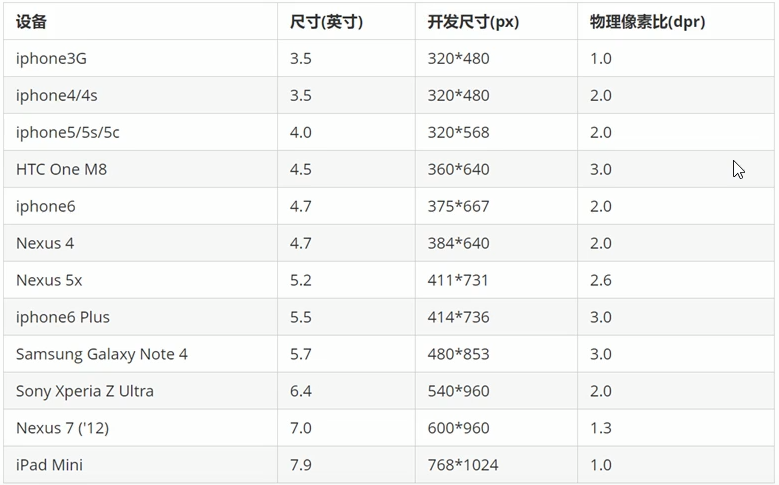

#### 1.4三种移动端调试方法

- Chrome Devtools模拟手机调试
- 搭建本地服务器，手机和服务器处于一个局域网内，手机访问
- 使用外网服务器


### 2.视口

视口(viewport)就是浏览器显示页面的**屏幕区域**。视口可以分为布局视口、视觉视口和理想视口

#### 2.1布局视口 layout viewport

- 一般移动设备的浏览器都**默认设置了一个布局视口**，用于解决早期的PC端页面在手机上显示的问题
- ios, Android基本都将这个视口分辨率设置为**980px**，所以PC上的网页大多都能在手机上呈现，只不过元素看上去很小，一般默认可以通过手动缩放网式。

#### 2.2视觉视口 visual viewport

字面意思，它是**用户正在看到的网站的区域**。

注意：是网站的区域我们可以通过缩放去操作视觉视口，但不会影响布局视口，布局视口仍保持原来的宽度

#### 2.3理想视口 idealviewport

为了使网站在移动端有最理想的浏览和阅读完度而设定

理想视口，对设备来讲，是最理想的视口尺寸

需要**手动添写meta视口标签**通知浏饩器操作

meta视口标签的主要目的：布局视口的宽度应该与理想视口的宽度致，简单理解就是设备有多宽，我们布局的视口就多宽

#### 2.4meta视口标签

标准的viewport设置如下

```html
<meta name="viewport" content="width=device-width,user-scaleble=no,initial-scale=1.0,maximum-scale=1.0,minimum-scale=1.0">
```

几个属性的值

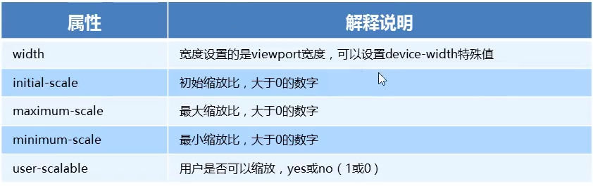


### 3.二倍图

#### 3.1物理像素&物理像素比

- **物理像素点**指的是屏幕显示的最小颗粒是物理真是存在的，如iPhone8的750x1334
- 在pc端1px就等于1物理像素比
- 但是在移动端，不太一样，有的是两倍的关系
- 1px能显示的物理像素点的个数，就叫**物理像素比**

在移动端，1px等于多个物理像素点的原因是，Retina(视网膜屏幕)显示技术，将更多的物理像素点压缩在一块屏幕内，来提高分辨率

#### 3.2多倍图

- 一张50*50的图片在视网膜屏的手机中打开，由于物理像素比的原因，会被放大倍数，而变模糊
- 为了解决这个问题，我们通常使用倍图来解决这个问题，就是指如果需要50x50的图片，移动端我们需要需要准备100x100的高质量图片，将大小设置为50*50，这样在移动端就不会变模糊了


### 4.移动端开发选择

#### 4.1移动端主流方案

1.单独制作移动端页面（主流方案）

京东手机商城

淘宝触屏版

2.响应式页面兼容移动端

三星官网


### 5.移动端技术解决方案

#### 5.1移动端浏览器

移动端浏览器大多数用的都是webkit内核，对c3和h5兼容性好，兼容性问题只需要加webkit前缀就行了

#### 5.2css初始化 normalize.css

移动端推荐normalize.css

http://necolas.github.io/normalize.css/

#### 5.3css3盒子模型 box-sizing

传统盒子模型content-box

盒子宽度=width + padding + border


c3盒子模型border-box

盒子宽度=width


移动端可以全用c3盒子模型

PC端如果完全需要兼容，使用传统盒子模型

#### 5.4特殊样式

```css
/*点击高亮默认为淡蓝色 需要清除设置transparent*/
-webkit-tap-highlight-color:transparent;
/*在移动端浏览器默认的外观在ios上加上下面属性才能给按钮和输入框自定义样式*/
-webkit-apperance:none;
/*禁用长按页面时的弹出菜单*/
/*这个好像没用*/
img,a {
    -webkit-touch-callout:none;
}
```


### 6.移动端常见布局

#### 6.1单独制作移动端页面

- 流式布局(百分比布局)
- flex弹性布局
- less+rem+媒体查询布局
- 混合布局

#### 6.2响应式布局

- 媒体查询

- bootstrap


## 流式布局(百分比布局)

### 6.1流式布局

- 流式布局也就是百分比布局，也称非固定像素布局
- 将盒子的宽度设置成百分比来根据屏幕的宽度来进行伸缩，不受像素限制
- 可以设置max-width和min-width


### 6.2京东移动端首页

#### 二倍精灵图做法

- 先将精灵图等比缩放为原来的一半
- 然后根据大小测量坐标
- 代码里的background-size也要写原来精灵图的一半


## flex布局

### 1.flex布局概述

#### 1.1传统布局与flex布局

- 传统布局兼容性好，布局繁琐，但是有局限性，不能再移动端很好的布局

- flex弹性布局操作方便，布局简单，但是有兼容性问题，在IE11或更低版本，不支持或仅支持部分
- 建议PC端用传统布局方式，移动端或者不考虑兼容性问题的PC端页面，用flex弹性布局


### 2.flex布局原理

#### 2.1原理

flex是flexible box的缩写，意思是“弹性布局”，任何一个容器都可以指定为flex布局

- 当父盒子设置为flex布局之后，子元素的float、clear、vertical-align等属性将失效
- 伸缩布局=弹性布局=舌锁盒布局=弹性盒布局= flex布局

采用flex布局的元素，成为flex(flex container)容器，它的所有子元素自动成为容器成员，成为flex项目(flex item)，简称项目


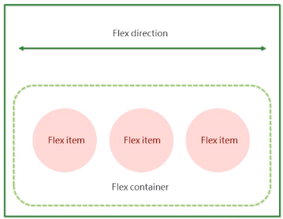

**总结：flex布局原理就是通过给父盒子添加flex属性，来控制子盒子的位置和排列方式**


### 3.flex布局父项常见属性

#### 3.1常见父项属性

- flex-direction：设置主轴的方向
- justify-content：设置主轴上子元素的排列方式
- flex-wrap：设置子元素是否换行
- align-content：设置侧轴上的子元素的排列放肆（多行）
- align-items：设置侧轴上子元素的排列方式（单行）
- flex-flow：复合属性，相当于同时设置了flex-direction和flex-wrap


#### 3.2flex-direction设置主轴方向

##### 3.2.1方向

默认主轴是x轴方向，水平向右

默认侧轴方向是y轴方向，水平向下

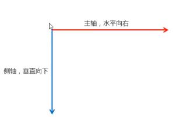

##### 3.2.2属性

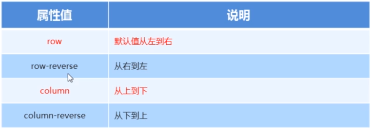


#### 3.3justify-content设置主轴上的子元素排列方式

使用该属性之前，要先确定主轴

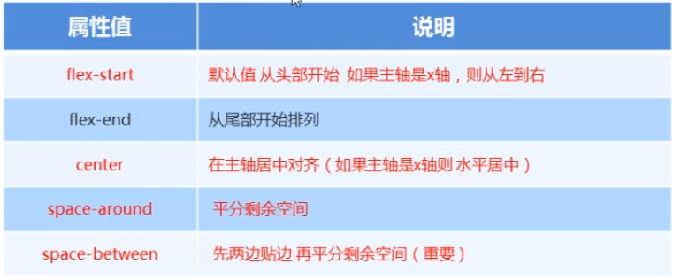


#### 3.4flex-wrap设置子元素是否换行

默认情况下是不换行的，如果装不下，会缩小子元素宽度

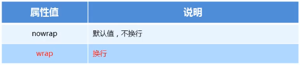


#### 3.5align-items设置侧轴上的子元素排列方式（多行）

控制子项在侧轴上的排列方式，在子项为单行时使用（多行不能使用）

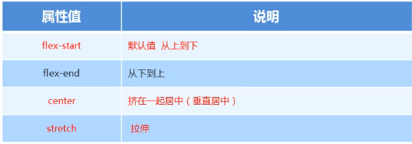

sretch属性用的较少，子项不能设置高度


#### 3.5align-content设置侧轴上子元素的排列方式（多行）

在子项出现多行时使用，单行没有效果

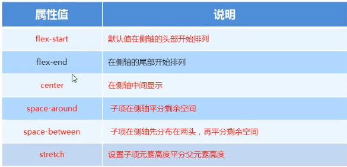


#### 3.6flex-flow复合属性

是flex-direction和flex-wrap的复合属性，相当于简写

`flex-flow:row wrap`


### 4.flex布局子项常见属性

- flex 子项占的份数
- align-self 控制子项自己在侧轴的排列方式
- order 属性定义子项的排列顺序


#### 4.1flex

定义子项**分配剩余空间**份数

`flex:1;//默认是0`

也可以写百分比，是相对于父级来说的


#### 4.2align-self 控制子项自己在侧轴的排列方式（了解）

默认是auto表示继承父元素align-items属性

还可以设置flex-start和flex-end


#### 4.3order设置子项排列属性

默认是0

值越小排列越靠前


### 携程首页

#### 背景渐变

背景线性渐变

**语法：**

```css
background:linear-gradient(起始方向，颜色1，颜色2，颜色3......);
background:-webkit-linear-gradient(left,red,blue);
background:-webkit-linear-gradient(to right,red,blue);
background:-webkit-linear-gradient(right bottom,red,blue);
```

背景渐变需要加浏览器私有前缀

方向可以使方位名词或者度数，省略默认是top


## rem布局

### 1.rem基础

##### rem是一个单位(root em)

rem是一个相对单位，类似em，em是相对于父元素字体大小。

rem是相对于html元素的字体大小


rem的优点是可以通过控制html里文字的大小来控制页面中元素的大小


### 2.媒体查询

#### 2.1媒体查询

media query是CSS3的新语法

- 使用@media查询，可以针对不同的媒体类型定义不同的样式
- @media可以针对不同的屏幕尺寸设置不同的样式
- 当你重置浏览器大小的过程中，页面也会根据浏览器的克度和高度重新渲染页面
- 目前针对很多苹果手机、 Android手机，平板等设备都用得到多媒体查询


#### 2.2语法

```css
@media mediatype and|not|only (media feature) {
	CSS-Code
}
```

- 用@meda开头注意@符号
- mediatype媒体类型
-  关键字and not only 
- media feature媒体特性必须有小括号包含


##### 2.2.1mediatype查询类型

把不同的终端划分为不同的类型，称为媒体类型

| 值     | 解释                               |
| ------ | ---------------------------------- |
| all    | 用于所有设备                       |
| print  | 用于打印机换个打印预览             |
| screen | 用于电脑屏幕、平板电脑、智能手机等 |

最重要的是screen


##### 2.2.2关键字

- and
- not 
- only


##### 2.2.3媒体查询+rem实现动态变化


#### 2.3引入资源

当样式比较繁多时，我们可以针对不同的媒体使用不同的css

原理是在link中判断设备的尺寸，然后引用不同的css文件

##### 语法

```html
<link rel="stylesheet" media="mediatype and|not|only (media feature)" href="mystylesheet.css">
```


建议：媒体查询从小往大写


### 3.less

#### 3.1维护css的弊端

css是一门非程序式语言，没有变量、函数作用域等概念

- css需要书写大量看似没有逻辑的代码，冗余度较高
- 不方便维护，不利于复用
- css没有很好的计算能力


#### 3.2less介绍

less（leaner style sheets）是一门CSS扩展语言，也称CSS预处理器

less没有减少CSS的功能，而是在现有CSS语法上，为CSS加入了程序式语言的特性

在CSS语法基础上，引入了变量，Mixin（混入），运算及函数等功能


#### 3.3less使用

- less变量
- less编译
- less嵌套
- less运算
- less函数（自己看一下）


##### 3.3.1less变量

语法

```less
@变量名:值;
@color:pink;
```

变量命名规则：

- 必须有@前缀
- 不能包含特殊字符
- 不能以数字开头
- 对大小写敏感（@color 和 @Color是两个不同的变量）


##### 3.3.2less编译

less文件不能直接引入到html中，需要编译为css 文件

vscode的easy less插件用来把less文件编译成css文件


##### 3.3.2less嵌套

常见用法

```less
div {
	width:200px;
	height:200px;
	a {
		color:pink;
	}
}
```

如果遇到交集、伪类、伪元素选择器

- 内层选择器需要加&符号，否则它会被解析为父选择器的后代

```less
div {
	width:200px;
	height:200px;
	a {
		color:pink;
		&:hover {
			color:green;
		}
	}
}
```


##### 3.3.3less运算（重点）*

在less中任何数字、颜色或者变量都可以参与运算（加减乘除）

```less
@width:5px + 5;
div {
	width:200px;
	height:200px / 2;
	border:@width solid #ccc;
}
img {
	width:82 / 50rem;
	height:82 / 50rem;
}
```

注意：

- 运算符左右两侧必须有一个空格格开
- 两个数参与运算，如果有一个有单位，最后的单位以这个单位为准
- 两个数参与运算，都有单位，以第一个为准


### 4.rem适配方案

单位都用rem，然后用媒体查询控制html的字体大小


#### 4.1rem实际开发适配方案

- 按照设计稿与设备宽度的比例，动态计算设置html根标签的font-size字体大小
- css中，设计稿元素的宽、高、相对位置等取值，按照同等比例转化为rem单位


#### 4.2市场主流的两种方案

1.less + 媒体查询 +rem

2.flexible.js + rem（推荐）


#### 4.3less + 媒体查询 +rem

##### 4.3.1常见设计稿宽度

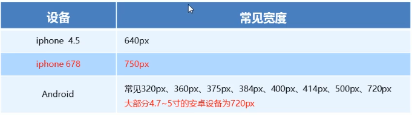


##### 4.3.2动态设置html标签的font-size大小

简单来说就是，把屏幕大小划分为若干等分

每一份作为html字体大小

750px的设计稿中100*100的元素在750屏下，rem=50px，

在320屏下，rem=21.33px

宽高都应设为2rem


**元素大小取值**：

页面元素rem值=页面元素值（px）/（屏幕宽度/划分等分)


### 5.苏宁移动端

@import

可以把一个样式文件导入到另一个样式文件中


##### flexible.js

原理是自动把设备屏幕划分为10等分

设置相应的rem大小即可


##### cssrem插件

一个可以在css中把px转换为rem的插件

注意需要到设置里面去设置rem-root的大小


## 响应式布局

#### 响应式布局原理

使用媒体查询，针对不同的宽度进行布局和样式的设置

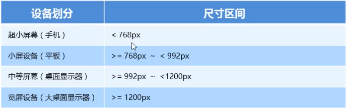


#### 响应式布局容器

响应式布局需要一个父级盒子作为布局容器，来配合子级元素实现变化效果

原理就是在不同屏幕下，通过媒体查询来改变这个布局容器的大小，再改变里面子元素的排列方式和大小


##### 一般响应式尺寸划分

- 超小屏幕：设置宽度为100%
- 小屏幕：设置宽度为750px
- 中等屏幕：设置宽度为970px
- 大屏幕：设置宽度为1170px


#### bootstrap

用于响应式开发的框架


##### 栅格系统

bootstrap将container容器分割为12列，对应的列只需要设置响应的类名即可

**栅格参数**

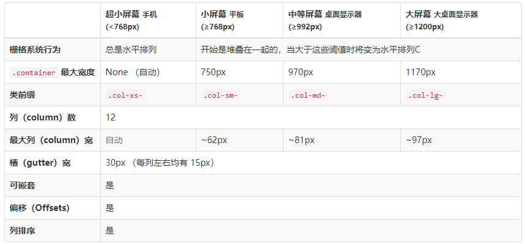

如果子盒子份数占不满12份，会有空白

如果子盒子份数超过12份，会另起一行显示


##### 栅格系统嵌套

栅格系统可以嵌套，但是要在一列里面在放不同的列时，需要加一个行，然后在里面放列


##### 列偏移

用`.col-md-offset-*`类可以将列向右偏移，本质是为元素加了左外边距


##### 列排序

通过使用 `.col-md-push-*` 和 `.col-md-pull-*` 类就可以很容易的改变列（column）的顺序


##### 响应式工具

针对不同屏幕尺寸设置显示与隐藏

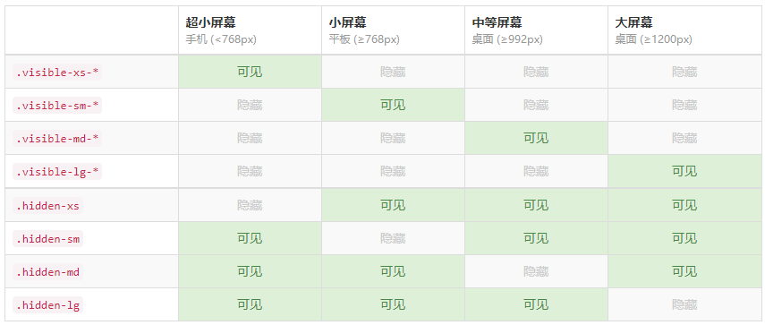